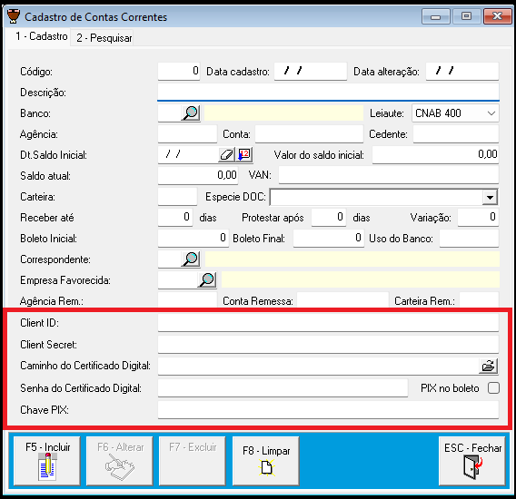
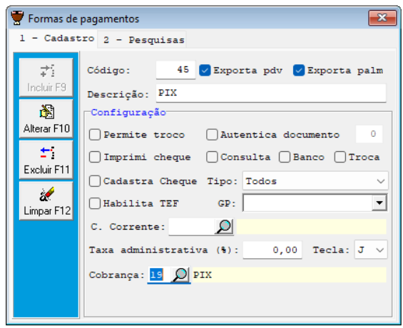
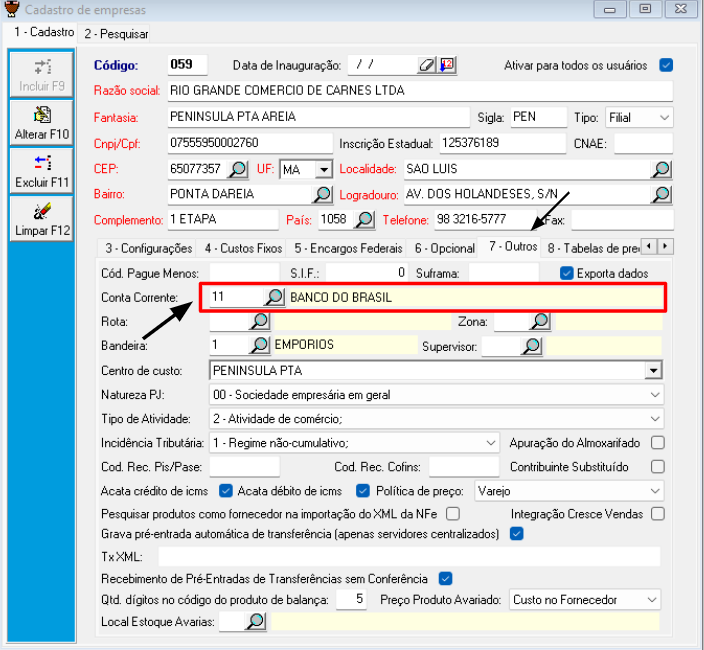

# Integração com o PIX Bacen - SGE

Este documento detalha os recursos e regras de negócio do micro serviço **Pix Bacen**, atualmente em desenvolvimento nos ambientes SandBox do Banco do Brasil e Itaú. Abaixo, seguem as instruções para integração e configuração do Pix Bacen.

## Integração

Para integrar o Pix Bacen, é necessário seguir os passos abaixo:

1. **Contato com o PSP**: Contate o PSP (Prestador de Serviço de Pagamento) que receberá os pagamentos para iniciar o processo de integração.
2. **Homologação**: Passe pelo processo de homologação, onde o sistema será testado para garantir conformidade técnica e de segurança.
3. **Credenciais e Certificados**: Crie credenciais específicas e gere certificados digitais, conforme as diretrizes fornecidas pelo banco, para garantir uma comunicação segura entre os sistemas.

### PSPs já Integrados com o SGE

- Banco do Brasil
- Itaú

## Pré-requisitos no SGE

- Substituir o `sgeWS` pela versão mais atual.
- Atualizar o Caixa para a versão 3469 ou superior.
- Rodar o `configuraPixBacenWin` em modo administrador (caso o PSP seja o Banco do Brasil).
- Configurar o ambiente SGE com as credenciais do PSP.

## Configuração no SGE

### 1. Conta Corrente



#### Client ID e Secret ID

- Chaves referentes à conta corrente do cliente, necessárias para acesso à API Pix Bacen de qualquer PSP.

#### Caminho do Certificado Digital e Senha

- Certificado digital usado para emissão da Cobrança Pix.
- Armazene o certificado em uma pasta na rede acessível para todos os usuários do SGE.
- **Não** é necessário instalar o certificado, apenas referenciar o caminho no respectivo campo no SGE.

#### Chave Pix

- Informe uma chave Pix referente à conta de PSP cadastrada na API.

### 2. Forma de Pagamento



#### Descrição

- A descrição deve, obrigatoriamente, conter o nome **PIX**.

#### Cobrança

- A cobrança deve ser configurada como **PIX**.

### 3. Empresa



#### Aba "Outros"

- No cadastro da empresa, na aba "Outros", deve haver o vínculo da mesma com a conta corrente cadastrada.

## Configuração para o Banco do Brasil (No Caixa)

Execute o seguinte comando SQL para configuração:

```sql
UPDATE TB_EMP 
SET EMP_PIXWORKSPACEID = {ApiKey} 
WHERE EMP_CODI = {CodigoEmpresa};
```

## SUPORTE
- Para análise de erro, é necessário ter acesso ao documento .dpm que se encontra em C:/Sistemas/SGEIBNFCE/SGEWS/LogGeral

## Erros

###  1. The SSL connection could not be established, see inner exception. 
#### Detalhes
- Esse Erro acontece quando o Windows tem o handshake 32K (Padrão do Sistema Operacional)
#### Solução
- Rodar o Arquivo configuraPixBacenWin em modo administrador

## Glossário
---
    - ApiKey        : Codigo de Indentificação do Serviço Usado
    - CodigoEmpresa : Codigo da empresa 
    - PSP           : Banco ou Intermediarios no processo de Cobrança Pix
