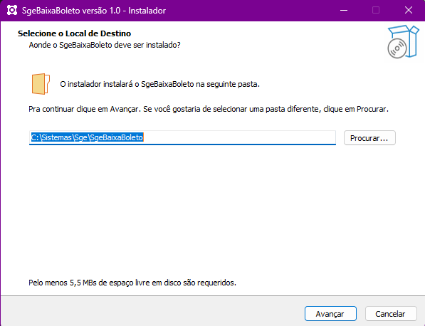
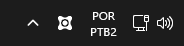
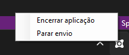
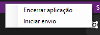
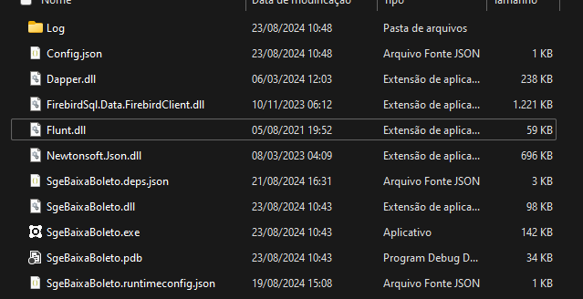
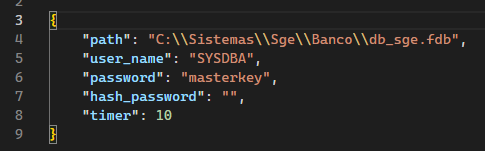
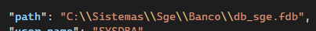

# Implantação do SgeBaixaBoleto

Funcionalidade responsável por dar baixa nos boletos

## Bancos integrados com o Sge

- Itau
- Santander

## Fluxo

- Ao excluir um título no Sge, esse título ficará marcado para ser baixado no respectivo banco
- Para isso acontecer algumas regras precisam ser obedecidas:
- 1° A conta corrente que emitiu o boleto precisa estar marcada como **Pix no boleto**, para mais detalhes acesse a [documentação do boletopix](../SgeWS/Implementação.md)
- 2° O boleto precisa ter sido impresso (exibido na tela) pelo menos uma vez

## Serviço

- O serviço irá executar a cada x minutos (configurável), e verificar se exisem título que foram cancelados e que obedeçam as regras já mencionadas
- Caso ocorra, irá iniciar o envio dos títulos.

## Pré requisitos para instalação

### .Net 8

- Runtime do .Net 8 Desktop necessário para execução do serviço
- [Download na Microsoft](https://dotnet.microsoft.com/pt-br/download/dotnet/thank-you/runtime-desktop-8.0.11-windows-x64-installer)

## Instalação e configuração do serviço

### Instalações e primeiros passos
- O link de download do instalador do serviço se encontra em [InstaladorSgeBaixaBoleto](/SgeBaixaBoleto/Arquivos/InstaladorSgeBaixaBoleto.rar)
- Ao instalar, por padrão ele irá recomendar que instale na pasta do Sge: C:\Sistemas\Sge\SgeBaixaBoleto:

    

- Recomendamos que deixe na pasta padrão, para melhor gerenciamento dos serviços da SGE
- No final da instalação, o instalador perguntará se já deseja executar o serviço, clique em sim
- O serviço ficará sendo executado em segundo plano, com um ícone banco da SGE exibido na barra de tarefas
- Icone mencionado:

    

- Ao clicar com o botão direito sobre o ícone são exibidas duas opções:
- Parar envio e encerrar aplicação

    

- Ao clicar em encerrar a aplicação, a aplicação é finalizada
- Ao clicar em parar envio, a consulta dos títulos é pausada, e o status do botão muda para **Iniciar envio**, como na imagem abaixo:

    

- Caso clique em iniciar envio, a consulta dos títulos é iniciada novamente e o status do botão muda para **Parar envio**

- De inicio, a aplicação deve ser encerrada, para configurar os parâmetros do banco de dados e do intervalo de tempo para o envio

### Configuração dos parametros no arquivo de configurações

- Na pasta já mencionada **C:\Sistemas\Sge\SgeBaixaBoleto** irá conter uma estrutura assim:

    

- Onde **Log** é a pasta de logs do serviço, onde cada arquivo será o log de um dia
- **SgeBaixaBoleto.exe** é o serviço a ser executado
- **Config.json** é o arquivo de configurações que precisa ser editado
- Os demais arquivos são dependencias para o serviço funcionar corretamente
- O arquivo contém 5 parametros:

    

- **path** é o caminho do banco de dados
- **user_name** é o nome de usuário do banco de dados
- **password** é a senha do banco de dados
- **hash_password** é a senha do banco de dados criptografada
- **timer** é o intervalo de **tempo em minutos** em que o serviço será executado

- o campo **hash_password** não precisa ser preenchido, ele será automaticamente calculado na próxima execução do serviço
- OBS: Em arquivos json, a bara "\\" precisa ser informada duas vezes:
- Como na imagem abaixo

    

## Inicialização do serviço

- Após as configurações estarem concluidas, iniciar novamente o serviço

### O log deverá se parecer com o seguinte:

    26/08/24 12:34:31 -> Iniciando a aplicação
    26/08/24 12:34:31 -> Envio de boletos iniciado

### Após o tempo configurado, o serviço iniciará a consulta e o envio dos títulos cancelados

    26/08/24 12:37:31 -> Executando consulta
    26/08/24 12:37:32 -> 2 Título(s) encontrado(s)
    26/08/24 12:37:32 -> Iniciando envio das baixas
    
### Após a execução o log irá informar se deu sucesso ou algum erro

### Exemplo de sucesso:
#### Santander
    26/08/24 14:31:06 -> Iniciando envio de baixa Santander - Titulo 0001552048010
    26/08/24 14:31:08 -> Título 0001552048010 baixado com sucesso
    26/08/24 14:31:08 -> Boleto baixado com sucesso | Código do Convênio: 0020353 | Nosso Número:   0001552048010 | Mensagem:  | 

#### Itau
    26/08/24 14:31:05 -> Iniciando envio de baixa Itau - Titulo 109552047017
    26/08/24 14:31:06 -> Título 109552047017 baixado com sucesso

### Exemplo de erro:
### Santander
    26/08/24 12:36:32 -> Iniciando envio de baixa Santander - Titulo 0001552048010
    26/08/24 12:37:36 -> Falha ao baixar título 0001552048010 - Erro: Código: 4 | Campo:  | Mensagem: Nosso numero inexistente | 

### Itau
    26/08/24 12:36:31 -> Iniciando envio de baixa Itau - Titulo 109552047017
    26/08/24 12:37:36 -> Falha ao baixar título 109552047017 - Erro: Campo: COD-RET | Mensagem: Título não encontrado | Valor:  | 

- Para mais detalhes sobre manutenção acesse: [Manutenção](/SgeBaixaBoleto/Manutencao.md)