## Sumário
- [Introdução](#introdução)
- [Habilitar produtos](#habilitar-produtos)
    - [Cadastros e estoque](#cadastros-e-estoque)
    - [Nome e descrição](#nome-e-descrição)
    - [Marca](#marca)
    - [Preço](#preço)
    - [Dimensões](#dimensões)
- [Menu de navegação](#menu-de-navegação)
- [Páginas](#páginas)
    - [Home](#Home)
    - [Configurações Sge](#configurações-sge)
    - [Serviço de envio](#serviço-de-envio)
    - [Logs](#logs)
- [Download CSV](#download-do-csv)
- [Funcionamento do serviço](#funcionamento-do-serviço)
    - [Intervalo de tempo](#intervalo-de-tempo)

# Introdução

### O integrador Sge x Nuvemshop realizará a sincronização dos produtos e categorias do Sge com a plataforma Nuvemshop
### O integrador irá monitorar as alterações e movimentações feitas nos produtos habilitados para e-commerce e sincronizar com a loja da Nuvemshop

# Habilitar produtos

### Abaixo o passo a passo de como habilitar os produtos para o envio para a plataforma da Nuvemshop

## Cadastros e estoque
#### Os produtos que serão integrados precisam estar sinalizados via reserva de estoque. Esta configuração fica no cadastro de produtos, aba F – Reserva Estoque, e a coluna a ser preenchida é Web/App % da respectiva loja
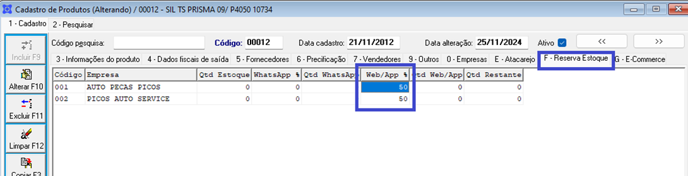

### A coluna Web/App % refere-se ao percentual do estoque que deve estar disponível para o e-commerce.
### Exemplo:
- Se o estoque atual do produto é 10 unidades e o percentual está 50%, o e-commerce irá receber um estoque disponível de 5 unidades.

## Nome e descrição
### Também é necessário marcar a opção Habilitado na aba G – E-Commerce. 
### O campo “Descrição do Produto Web” será usado como nome na Nuvemshop e o campo “Características do Produto Web” será utilizado como descrição na Nuvemshop.
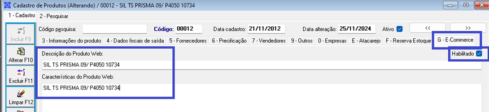

## Marca
### A marca do produto também será utilizada para envio:
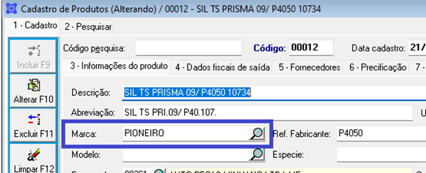

## Preço
### Os preços que serão enviados a Nuvemshop irão ser respectivamente: Preço a vista será o preço promocional, e o preço parcelado será o preço normal
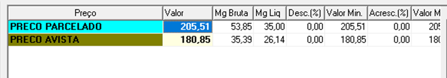

## Dimensões
### As dimensões do produto, na aba 9 – Outros > Dimensões/Volumes/Outros também deverão ser preenchidas
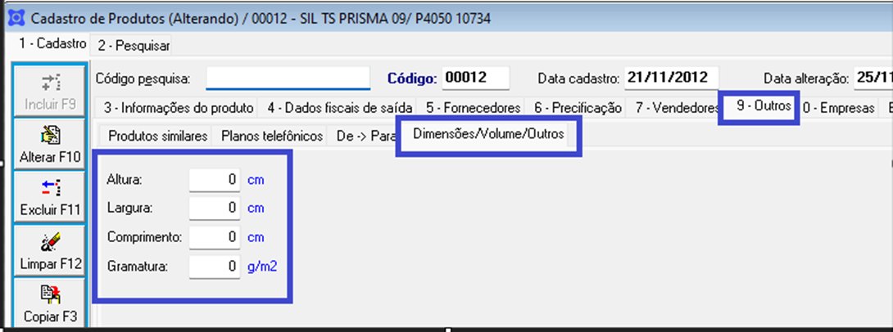

# Menu de navegação
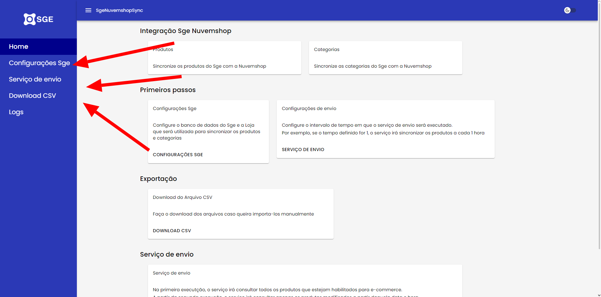

### O menu de navegação contém as páginas disponíveis no serviço
### As funcionalidades de cada uma serão detalhadas na sequência

# Páginas

### A aplicação contém 4 páginas:
### **Home**, página principal, que contém cards informando sobre o funcionamento do serviço
### **Configurações Sge**, página utilizada para configuração do banco de dados do Sge
### **Serviço de envio**, página utilizada para configuração do intervalo de tempo do serviço de envio
### **Logs**, página utilizada para exibição dos logs durante a sincronização

## Home

### A página Home é utilizada apenas para exibições de informações sobre o serviço de envio
### Esta é a página:
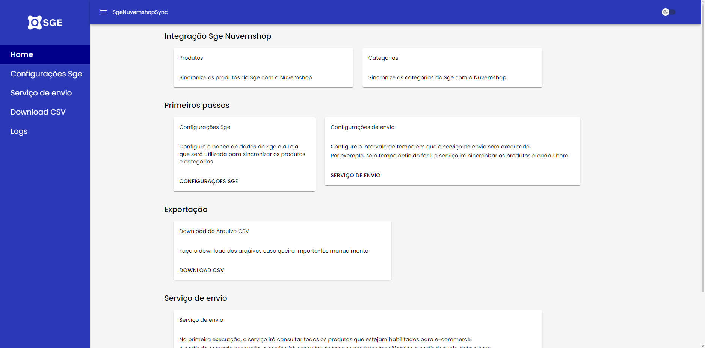

### A página contém apenas informações sobre o funcionamento do serviço

## Configurações Sge
### A página é utilizada para configuração do banco de dados do Sge e da loja que será utilizada para captura das informações que serão enviadas para a Nuvemshop
### Esta é a página:
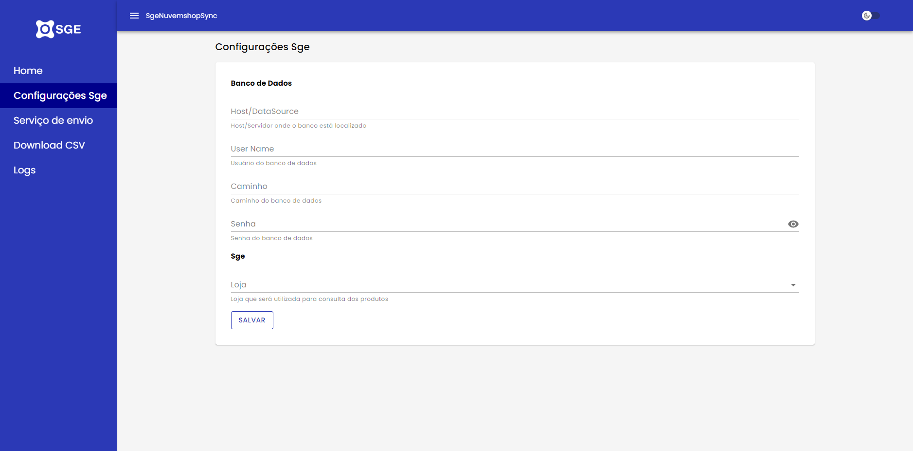

### A página contém 5 campos, sendo 4 deles de texto e 1 de seleção.
- Host/Datasource: Ip ou Domínio em que o banco de dados do Sge se encontra
- User Name: Usuário do banco de dados
- Caminho: Caminho onde o banco de dados está localizado
- Senha: Senha do banco de dados
- Loja: Este é um campo selecionável. O campo armazena a loja que será utilizada para captura das informações que serão enviadas para Nuvemshop, onde ficarão disponível depois da configuração do banco de dados, as lojas ativas.

## Serviço de envio
### A página é utilizada para configuração do serviço de envio dos produtos
### Esta é a página:
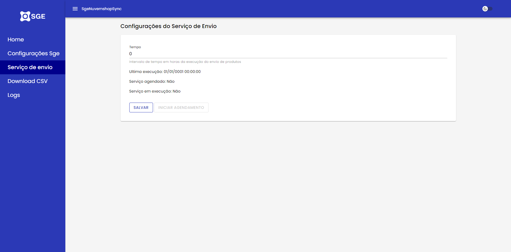

### A página contém 4 campos, sendo 1 editável e os outros 3 apenas para visualização
- Tempo: Será o intervalo de tempo em que o serviço será executado
- Ultima execução: Data da ultima execução do serviço
- Serviço agendado: Informa se o agendamento do serviço está ativo ou não
- Serviço em execução: Informa de o serviço está em andamento ou não

## Logs
### A página é utilizada apenas para visualização dos logs em tempo real

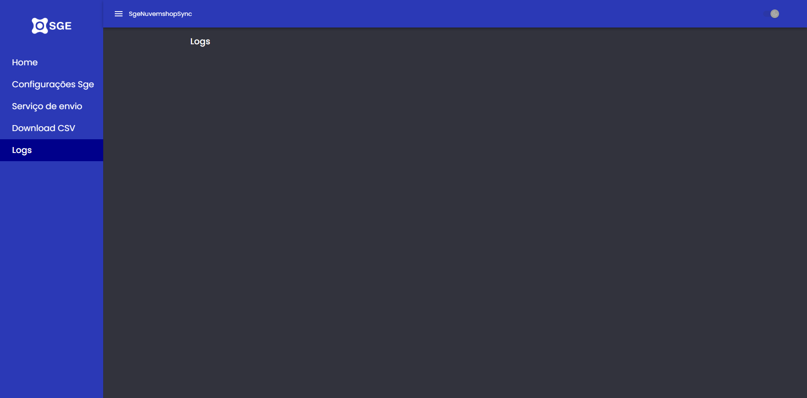

### Os logs também ficam disponíveis na pasta em que o Sge se encontra
### Geralmente em C:\Sistemas\
### Existirá uma pasta C:\Sistemas\SgeNuvemshopSync\ contendo os logs para análise de possíveis erros

## Download do CSV
### No menu de navegação ou na página Home é possível acessar o botão "Download CSV"
### Ao clicar no botão será exibida uma caixa de confirmação que irá perguntar se o usuário deseja realmente fazer o download do arquivo
### Visto que depedendo da quantidade de produtos, a geração do arquivo pode demorar
### Mensagem de confirmação:
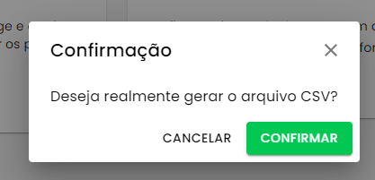

### Ao clicar em sim, o serviço irá exibir uma notificação no canto superior direito da tela indicando que a geração do arquivo foi iniciada:

### Ao final da geração, o arquivo será salvo na pasta de download, com o nome "produtos.csv"
### O arquivo já está no padrão da Nuvemshop, pronto para ser importado manualmente caso o usuário deseje
### Caso ocorra algum erro, uma notificação de erro será exibida informando o erro

# Funcionamento do Serviço
### Após as configurações do banco de dados do sge e o intervalo de tempo em que o serviço será executado
### Na página Serviço de envio, o usuário deverá clicar no botão "Iniciar agendamento"
### **Nota: O botão ficará indisponível caso a loja não tenha sido selecioada na página de Configurações Sge ou se o tempo for menor ou igual a zero**

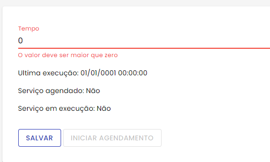
### Ao clicar nesse botão:
### O serviço irá ser agendado para ser executado no intervalo definido, 
- A sincronização irá começar imediatamente
- O serviço irá repetir o envio de acordo com o tempo definido
- O botão irá mudar o status para "Parar agendamento" que caso seja clicado, cancelará a sincronização

## Intervalo de tempo
### O serviço irá ser executado de acordo com o intervalo definido pelo usuário
### Por exemplo, o usuário definiu o tempo de 1h, então de 1h em 1h o serviço será executado
### Os itens capturados obedecerão a seguinte regra:
- Caso seja a primeira sincronização, o serviço irá capturar todos os produtos que estão habilitados para e-commerce
- Caso seja a segunda em diante, o serviço irá capturar os produtos que foram alterados ou tiveram movimentação de estoque desde a data da última execução do serviço